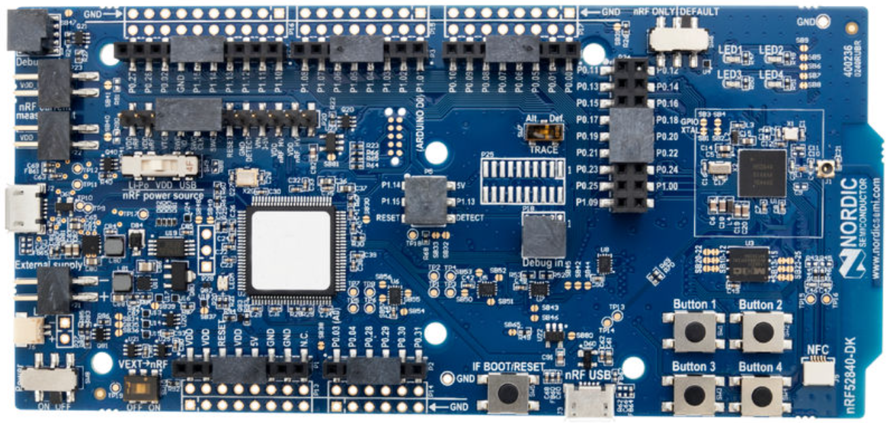
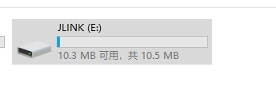
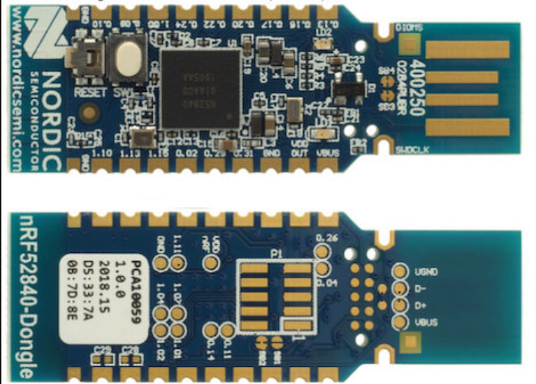

# 蓝牙控制器固件

目前在 qume 下运行此协议栈需要搭配蓝牙 Controller 芯片，以下固件都是在 Zephyr 环境下编译 hci 相关例程生成的，经实际使用测试，工作稳定。

参考：[hci-uart](https://docs.zephyrproject.org/latest/samples/bluetooth/hci_uart/README.html) 和 [hci-usb](https://docs.zephyrproject.org/latest/samples/bluetooth/hci_usb/README.html)


### hci_uart_nrf52840dk.hex



该固件使用的是 [nrf52840dk](https://www.nordicsemi.com/Products/Development-hardware/nrf52840-dk) 开发板，HCI 传输层为 H4 协议，波特率 115200，使用硬件控制流 CTS/RTS。

**Windows** 平台下载该固件比较简单，将 nrf52840dk 插入电脑，电脑会自动识别一个 `JLINK` U 盘，用鼠标将固件拖入该 U 盘即可。



**Linux** 平台下载该固件较为麻烦，需要使用工具 [J-Link Software and documentation pack](https://www.segger.com/downloads/jlink/) 和 [nRF Command Line Tools](https://www.nordicsemi.com/Products/Development-tools/nrf-command-line-tools)

下载固件流程：

1. 擦除芯片内程序

```shell
nrfjprog --eraseall -f nrf52
```

2. 写入固件

```shell
nrfjprog --program hci_uart_nrf52840dk.hex -f nrf52
```

3. 复位并启动

```shell
nrfjprog --reset -f nrf52
```

可参考：[nordic-segger](https://docs.zephyrproject.org/latest/develop/flash_debug/nordic_segger.html#nordic-segger)


**qemu 环境下使用提示**

使用 nrf52840dk 开发板 JLink 虚拟串口进行交互，当识别到 JLink 时，虚拟串口也可以被识别。

```
# 参考以下命令替换原有命令， /dev/ttyACM0 按照被识别的实际串口修改
qemu-system-arm -M vexpress-a9 -smp cpus=2 -kernel rtthread.bin -nographic -sd sd.bin -serial mon:stdio -serial /dev/ttyACM0
```


### hci_usb_nrf52840dongle.hex



该固件使用的是 [nrf52840dongle](https://www.nordicsemi.com/Products/Development-hardware/nrf52840-dongle) 开发板，HCI 传输层为 USB 协议。

下载该固件需要使用 [nRF Util](https://www.nordicsemi.com/Products/Development-tools/nRF-Util)，输入 `pip3 install nrfutil` 即可安装。

下载固件：

1. 按下 RESET 按钮进入 bootloader
2. 利用 nrfutil 打包固件

```shell
nrfutil pkg generate --hw-version 52 --sd-req=0x00 \
        --application hci_usb_nrf52840dongle.hex \
        --application-version 1 hci_usb_nrf52840dongle.zip
```

3. 写入固件，注意 Linux 环境下使用 `/dev/ttyXXX` 设备，Windows 使用 `COMx`，macOS 也类似。

```shell
nrfutil dfu usb-serial -pkg hci_usb_nrf52840dongle.zip -p /dev/ttyACM0
```

可参考：[Zephyr-nrf52840dongle](https://docs.zephyrproject.org/latest/boards/arm/nrf52840dongle_nrf52840/doc/index.html)


**qemu 环境下使用提示**

此固件会被识别成 hci 设备， 具体使用可参考 [QEMU 运行 BLE](https://www.rt-thread.org/document/site/#/rt-thread-version/rt-thread-standard/application-note/setup/qemu/qemu-ble/qemu_ble?id=qemu-运行-ble)

